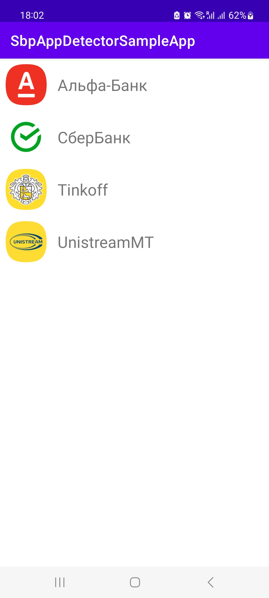

# SbpAppDetector

[](https://jitpack.io/#pust89/SbpAppDetector)

SbpAppDetector is an Android library that will help you find all applications on the device that are connected to the fast payment system [СБП](https://ru.wikipedia.org/wiki/%D0%A1%D0%B8%D1%81%D1%82%D0%B5%D0%BC%D0%B0_%D0%B1%D1%8B%D1%81%D1%82%D1%80%D1%8B%D1%85_%D0%BF%D0%BB%D0%B0%D1%82%D0%B5%D0%B6%D0%B5%D0%B9)
The library does not have ready-made visual solutions, so it weighs very little.

SbpAppDetector is distributed through [JitPack](https://jitpack.io/#pust89/SbpAppDetector/).

<p align="center">
    
</p>
   
  * [Adding a dependency](#adding-a-dependency)
  * [Basic usage](#basic-usage)
  * [Example App](#example-app)
  * [License](#license)
  * [Author](#author)


### Adding a dependency

Add repository ``` maven { url "https://jitpack.io" } ``` in your root build.gradle at the end of repositories:
```groovy
dependencyResolutionManagement {
    repositoriesMode.set(RepositoriesMode.FAIL_ON_PROJECT_REPOS)
    repositories {
        google()
        mavenCentral()
        maven { url "https://jitpack.io" }
    }
}
```

Add dependency to your `build.gradle` file of the module where you want to use SbpAppDetector.
```groovy
dependencies {
    implementation 'com.github.pust89:SbpAppDetector:2.0.0'
}
```

### Basic usage

```
     fun findSbpBanks() {

        val sbpAppDetector = SbpAppDetector.create(object : SbpAppDetector.Listener {
            override fun onSuccess(installedSbpBanks: List<SbpBank>) {
                Toast.makeText(requireContext(), "found ${installedSbpBanks.size} banks", Toast.LENGTH_SHORT).show()
            }

            override fun onLoading(isLoading: Boolean) {
                Toast.makeText(requireContext(), "isLoading $isLoading", Toast.LENGTH_SHORT).show()
            }

            override fun onFailure(throwable: Throwable) {
                Toast.makeText(requireContext(), throwable.message, Toast.LENGTH_SHORT).show()
            }
        })

        lifecycleScope.launch {
            sbpAppDetector.execute(context)
        }
    }
```

The **SbpBank** entity has methods to open bank Activity
```
    private val sbpBankAdapter by lazy {
        SbpBankAdapter {sbpBank ->
            sbpBank.startSbpActivity("${sbpBank.requiredSchema}://qr.nspk.ru/test", requireContext())
        }
    }
```


## Example App

SbpAppDetector comes with a **sample app**. You can find it inside the [/sample folder](https://github.com/pust89/SbpAppDetector/blob/master/sample/src/main/java/com/pustovit/sbp_app_detector_sample_app).


## License

```
    Copyright (C) 2015-2023 AppIntro Developers

    Licensed under the Apache License, Version 2.0 (the "License");
    you may not use this file except in compliance with the License.
    You may obtain a copy of the License at

       http://www.apache.org/licenses/LICENSE-2.0

    Unless required by applicable law or agreed to in writing, software
    distributed under the License is distributed on an "AS IS" BASIS,
    WITHOUT WARRANTIES OR CONDITIONS OF ANY KIND, either express or implied.
    See the License for the specific language governing permissions and
    limitations under the License.
```

## Author

[@Pustovit Vladimir](https://github.com/pust89)

vovapust1989@gmail.com

https://www.linkedin.com/in/vladimir-pustovit-b8b8a9204/

